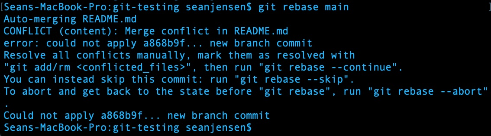
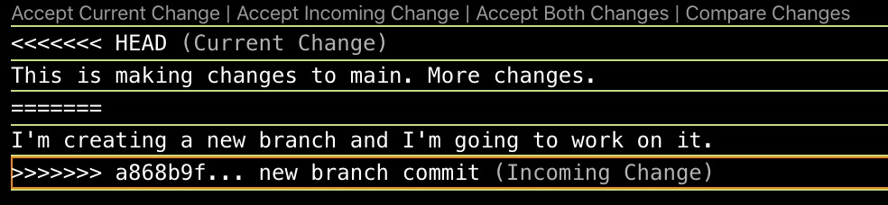
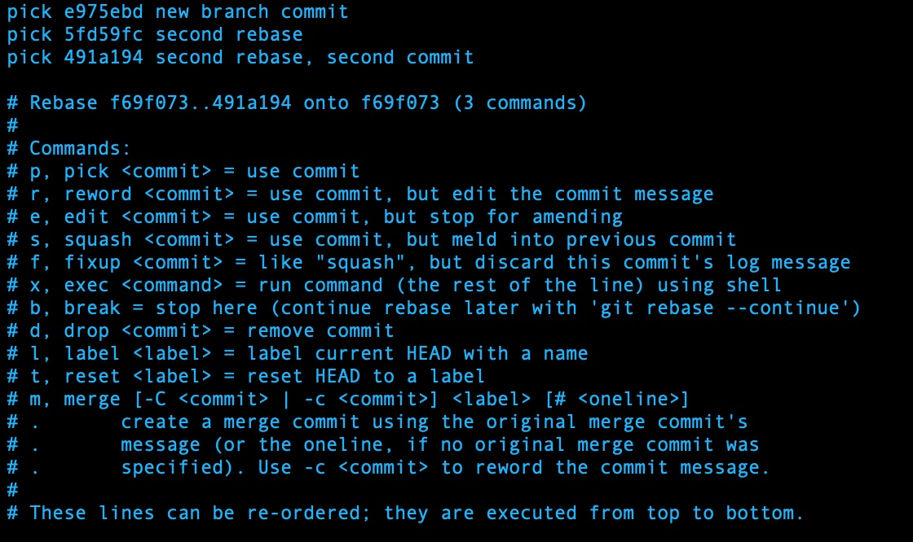
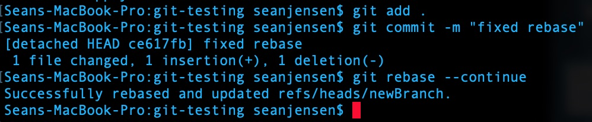
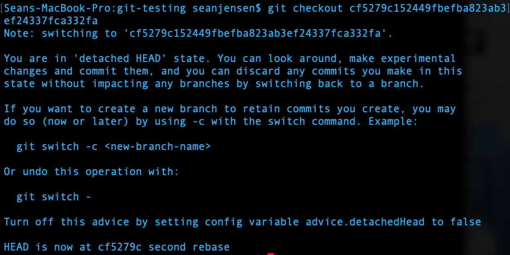
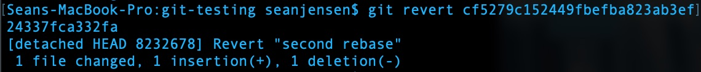

**Git Rebase**

In practice, there are times when simply merging two branches is insufficient. These are times when you might want to consider a rebase. When you perform a git rebase, you’re changing the branch of one commit to another. You’re turning a potentially confusing project history with multiple branches into one clean, linear history. Some potential advantages are that it can be easier to solve for bugs if you only have to sort through commits from one branch, or just to keep the repo more clean in general. However, in my experiences, especially on bigger projects, rebases can get very complicated. When manually parsing through two branches with a lot of differences, a rebase can quickly become a lengthy process. 

If git can't merge a rebase automatically, you'll be required to manually select which parts you want to keep and which parts you want to get rid of. Visual studio code helps us do this.

After we make our changes, we can successfully complete the rebase. 

Running an interactive rebase (git rebase {branch} -i) will automatically open a VIM window. The commits are listed at the top as well as possible actions we can apply. Once we're satisfied with our selection, we enter :wq.

Once again this allows us to complete the rebase.

**Git Reset**

The git reset tool is broadly meant to undo changes in a git repo. There are three variants:

Hard - The hard git reset can be especially risky. It will change the commit history, then revert the staging index and the working directory to a previous commit. 

Mixed - Conversely, mixed will only reset the staging index to a specified commit and the working directory will follow suit. 

Soft - A soft reset only changes the commit history. It won’t make changes to the staging index or the working directory. 

**Git Checkout**

Git checkouts are typically used to change branches, but the command is actually surprisingly versatile. It can also switch between different files and commits, as well as branches. When you switch branches, Git will update the working directory to reflect that new branch. 

**Git Revert**

A git revert functions as a sort of “undo.” But it doesn’t literally return you to a previous commit. Instead, it emulates this effect by creating a new commit based off of an older commit. If you’ve created a bug in a new commit, a revert is a safe and effective way to return to an older commit. 

**Differences and Similarities**

Git Reset, Git Revert, and Git Checkout can all be used to functionally “undo” a new commit. They are similar in that aspect, but all three of them function in different ways. 

Reset is the most committal and, in some ways, the most risky. Depending on which variant you use, you can risk losing work that’s currently in your working directory or staging index. Git checkout is a versatile tool, but when used to change directly from one commit to another. Git revert will duplicate an old commit and add it to the end of the working history.

**Uses**

You might use a git reset if you wanted to completely do away with a new commit and return to an older commit. You could also potentially use it to undo changes to the staging index or onstage a file.

A git checkout won’t change the commit history. If you want to take a branch in a different direction starting from a previous commit, you can do that without erasing newer commits. Checkout will move the head to whichever commit you checkout, however.

Revert is a quick and easy way to undo changes. It’s relatively simple, since it just creates a new commit based off of an older one. Though one potential downside could be that frequent reverts could make your commit history a bit chaotic. 

Git reset example:

Git checkout examples. The first is checking out an older commit of the repo. The second is applied only to a specific file. 

Example of a git revert:

**Git Submodules**

Git submodules exist within a larger git repository. They track specific commits from external code. Rather than automatically using the most up to date version of external code, you can snapshot and use a specific version from a specific commit. 

If you’re using a lot of dependencies in a big project there’s a lot of potential volatility if those external dependencies are updating frequently. By using git submodules, you allow yourself control over which versions you use. Subsequently, updates to external code will never create bugs or crashes in your own repo. 

Still, greater control over external dependencies creates more work and responsibilities for the project. Submodules force you to control versions of dependencies manually. Greater control and stability comes with a cost of additional upkeep. 