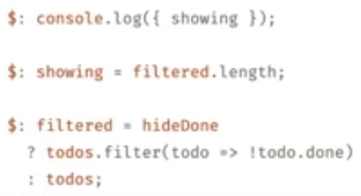

In his 2019 Code Camp presentation, Rich Harris went over a basic React program and poked holes in how inefficient it was, rerunning code over and over. He contends that "frameworks are tools for organizing your mind" and "compilers are the new frameworks." He proposes Svelte as a leaner, more efficient, more intuitive framework than React.

The demonstration on binding variables together was very interesting. Svelte implements a fairly simple solution to this problem, showing how you can bind variables, or even functions or pieces of code to variables. They'll update when the code they're attached to changes. As a React user and a fan of the framework, this was one thing from Svelte that really impressed me. 

One potential benefit of Svelte is that it will throw warnings if a website isn't written in an accessible way. Another benefit is that it will automatically scope CSS styles, and it will also throw warnings in response to unused CSS selectors. Personally, these all seem like great benefits. Svelte's built-in transitions were also extremely impressive. 

I was skeptical, but the presentation really sold me, both on the benefits of Svelte, as well as the relative simplicity of it.  